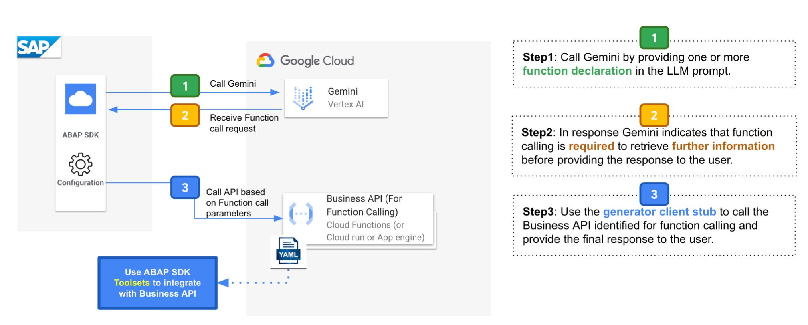

<h1 align="center">OpenAPI Generator for ABAP SDK for Google Cloud</h1>

## Introduction


For SAP customers who require services to be hosted on Google Cloud Platform, currently to consume such services within SAP in ABAP layer traditionally, this has more often necessitated third-party middleware for connection and invocation, adding complexity. 
The Open API Generator for ABAP SDK for Google Cloud addresses this by offering native integration within the ABAP layer on SAP. This empowers SAP customers to directly host their services on Google Cloud Platform, eliminating the need for additional middleware.

>>In essence, the Open API Generator for ABAP SDK transforms an Open API specification into ABAP code, facilitating the consumption of Google Cloud hosted services directly from within ABAP. The generated code seamlessly integrates with the ABAP SDK for Google Cloud, leveraging its robust client framework.

Leveraging the Open API Generator for ABAP SDK empowers SAP customers to achieve significant benefits some of which are listed below:
- **Streamlined IT Landscape**: By removing the reliance on external middleware, the complexity of your IT environment is reduced. This translates to simplified system management and maintenance, freeing up valuable resources.

- **Enhanced Agility**: The ability to effortlessly consume external services hosted on Google Cloud Platform boosts your organizational agility. You can rapidly integrate new services without extensive development cycles, accelerating business process innovation and optimization.

- **Simplified Development**: The native ABAP integration eliminates the need to learn new technologies or languages. Your development teams can leverage their existing ABAP expertise, further streamlining the integration process and reducing development costs.

## Overview

 - OpenAPI Generator for ABAP SDK for Google Cloud allows generation of API client libraries (SDK generation) automatically given an [OpenAPI Spec](https://github.com/OAI/OpenAPI-Specification) (both 2.0 and 3.0 are supported). 
- The generator accepts both file supported file formats of Open API Specification(OAS): YAML & JSON. 
- The generator creates API Clients, which are ABAP Classes that inherit from ABAP SDK for Google Cloud's HTTP Client Class: `/GOOG/CL_HTTP_CLIENT`. 
- The generated classes are compatible with [ABAP SDK for Google Cloud](https://cloud.google.com/solutions/sap/docs/abap-sdk/on-premises-or-any-cloud/whats-new). 
- To effectively utilize the ABAP classes to invoke the API methods, ABAP SDK for Google Cloud should be installed in your SAP system. This installation is a prerequisite.
   
## Table of contents

  - [OpenAPI Generator](#openapi-generator)
  - [Introduction](#introduction)
  - [Overview](#overview)
  - [Table of Contents](#table-of-contents)
  - [1 - Installation](#1---installation)
    - [1.1 - Compatibility](#11---compatibility)
    - [1.2 - Download JAR](#12---download-jar)
    - [1.3 - Download Installation Script](#13---download-installation-script)
    - [1.4 - Execute Installation Script](#14---execute-installation-script)
  - [2 - Getting Started](#2---getting-started)
  - [3 - Usage](#3---usage)
    - [3.1 - Upload to Cloud Storage](#31---upload-to-cloud-storage)
    - [3.2 - Direct Download](#32---direct-download)
    - [3.3 - Force Execution Mode](#34---force-execution-mode)
  - [4 - Ideas/Applications](#4---ideasapplications)

## [1 - Installation](#table-of-contents)

All the below installation steps are provided with Google Cloud Shell as the environment. Google Cloud Shell is a developer ready environment that's comes up with all the dependecies for execution OpenAPI generator pre-installed. To get started, go to Google Cloud Platform and activate the Cloud Shell. If you are new to Cloud Shell then you can read more about [Using Cloud Shell](https://cloud.google.com/shell/docs/using-cloud-shell)

### [1.1 - Compatibility](#table-of-contents)

OpenAPI Spec compatibility: 2.0 and 3.0 

### [1.2 - Download JAR](#table-of-contents)

To begin with, we will create a directory(folder) on Cloud Shell and use it as our repository to install, configure and generate the API Client Stubs.

**STEP #1:** Run the following command on your Google Cloud Shell
```
mkdir openapi-abap-gen
```

Install the latest stable JAR version of openapi generator cli. The current most stable version is 7.7.0. \
JAR location: `https://repo1.maven.org/maven2/org/openapitools/openapi-generator-cli/7.7.0/openapi-generator-cli-7.7.0.jar`\

**STEP #2:** Go to the created directory by running the below command
```
cd openapi-abap-gen
```

_Note_: always create this directory with the provided name: `openapi-abap-gen` as the helper scripts will look for this directory


**STEP #3:** Install the Open API Generator
```
wget https://repo1.maven.org/maven2/org/openapitools/openapi-generator-cli/7.7.0/openapi-generator-cli-7.7.0.jar -O openapi-generator-cli.jar
```

### Installation Script

### [1.3 - Download Installation Script](#table-of-contents)

Download the installation script from the Github: https://raw.githubusercontent.com/GoogleCloudPlatform/openapi-generator-for-abap-sdk/main/src/install_abap_gen.sh

Alternatively you can download it using the following command
**STEP #1:**
```
wget https://raw.githubusercontent.com/GoogleCloudPlatform/openapi-generator-for-abap-sdk/main/src/install_abap_gen.sh
```

**STEP #2:** Provide required permissions
```
chmod 755 install_abap_gen.sh
```

The installation script makes the necessary changes to ready the OpenAPI generator to generate ABAP SDK for Google Cloud compatible ABAP Clients(Classes)

### [1.4 - Execute Installation Script](#table-of-contents)

Once you have downloaded the installation script and provided it with execution permissions, you can go ahead and execute it on your Cloud Shell with below command:

**STEP 1:**
```
./install_abap_gen.sh
```

This automatically clones this repo in your `openapi-abap-gen` directory and copies required files and mustache templates into relevant sub-directories.
It also downloads other required scripts required to perform various other operations.

Once you have successfully executed the installation script provide execute permissions to other helper scripts that are now available.

**STEP 2:**
```
chmod 755 start_abap_gen.sh
chmod 755 download_client.sh
```

## [2 - Getting Started](#table-of-contents)

To create an ABAP client based on your OpenAPI specification file, execute the following command:
```
./start_abap_gen.sh -i <Path to OpenAPI specification File>
```

The -i option designates the input OpenAPI specification. This specification can be a web-based file or a locally stored file. If it's a local file, ensure to provide the complete file path, including the file name.

In the example below, we're using the publicly available OpenAPI specification for the sample Petstore API [petstore.yaml](https://raw.githubusercontent.com/openapitools/openapi-generator/master/modules/openapi-generator/src/test/resources/3_0/petstore.yaml), please run the following command:

```
./start_abap_gen.sh \
 -i https://raw.githubusercontent.com/openapitools/openapi-generator/master/modules/openapi-generator/src/test/resources/3_0/petstore.yaml 
```

The -i option takes the input for Open API Spec.\

The Open API Spec can be stored locally as well, in that case the correct relative path has to be provided along with the file name.\
In the above example we are passing the Open API Spec for the sampel petstore API which is accessible publically.

In the following instance, we're employing a locally saved OpenAPI specification file named 'petstore.json' located in the '/home' directory to generate ABAP code for the sample Petstore API:

```
./start_abap_gen.sh -i /home/petstore.json 
```

## [3 - Usage](#table-of-contents)

### Generator Script Usage
The generation script `start_abap_gen.sh` can take multiple arguments ans also performs certain validations.\
To know about the usage and options of this script, you can run the below command:

```
./start_abap_gen.sh -h
```

or

```
./start_abap_gen.sh --help
```

### [3.1 - Upload to Cloud Storage](#table-of-contents)

If you would like to store the generated ABAP Clients(Classes) to Cloud Storage then you can achieve the by passing the bucket id to the generation script.
An example is shown below:

```
./start_abap_gen.sh \
 -i https://raw.githubusercontent.com/openapitools/openapi-generator/master/modules/openapi-generator/src/test/resources/3_0/petstore.yaml \
 -b example_bucket_name
```

- The -b argument takes the bucket id.
- The script validates if the bucket id exists or not.
- To validate and store the files to the give bucket you would need relevant IAM roles listed below:
  - Storage Object Viewer(roles/storage.objectViewer)
  - Storage Object User(roles/storage.objectUser)

### [3.2 - Direct Download](#table-of-contents)

If the `start_abap_gen.sh` script has executed successfully (with option -b or without), at the end it will ask if you would like to download the generated files.\
To download the generated files, you can enter `y`, if you do not want to download the files please enter `n`.\
If you have pressed `y` then all the required files will be downloaded as a zip folder and you will get a pop-up to confirm download.\
The files will be downloaded to your download director as a zip file, which you can unzip and extract the contents.
In case you wish not to download, the script provides you the location of where the generated files are stored and exits.

In case the download fails, or if you would like to just download again you can run the below script from directory `openapi-abap-gen`
```
./download_client.sh
```

This will download the latest generated files.

### [3.3 - Force Execution Mode](#table-of-contents)
Force execution is an advanced option available in case you make any of your changes to Class AbapGenerator.java or Mustache Templates.\
Force execution mode rebuilds the maven even if the build exists.

To execute the generator script in force mode you can run the below command:

```
./start_abap_gen.sh \
 -i https://raw.githubusercontent.com/openapitools/openapi-generator/master/modules/openapi-generator/src/test/resources/3_0/petstore.yaml \
 -f
```

## [4 - Ideas/Applications](#table-of-contents)

### Purpose: The Intention

[ABAP SDK for Google Cloud](https://cloud.google.com/solutions/sap/docs/abap-sdk/overview) is a SDK that enables SAP customers to integrate their SAP systems with Google Cloud services. \
Currently, the SDK provides ABAP classes (clients) for over 75 standard Google APIs, accessible via their Discovery Documents.

However, we recognize that our customers may also need to interact with custom-developed APIs, private APIs, or Cloud Endpoints, often defined using the Open API Specification (OAS).\
To address this, we have developed this extension to Open API Generator.

### Key Benefits to Customers

- **Expanded API Support**: You can now easily generate ABAP clients for a wider range of APIs, increasing the flexibility and power of the ABAP SDK.
- **Streamlined Integration**: The automated client generation process significantly simplifies and accelerates the integration of SAP systems with custom or specialized Google Cloud services

### A Note to SAP Developers and Architects
SAP Developers and Architects, you can now explore the potential of building holisitic business tailored solutions on Google Cloud.\
The OpenAPI Generator for ABAP SDK aims to solve the key integration step when building such holistic solutions as it provides a simple & efficient mechanism to consume your custom/private APIs.
The generated client stubs are built compatible with the framework of ABAP SDK for Google Cloud which takes care of various authentication types, json, logging and error handling.

There are multiple ways to host your APIs on Google Cloud and the following blog: [Navigating the Cloud API Maze: Apigee, GCP API Gateway, or GCP Cloud Endpoints?](https://medium.com/google-cloud/navigating-the-cloud-api-maze-apigee-api-gateway-or-cloud-endpoints-6bc772b44ff4) serves as a great starting point to understand various options.

### A Glimpse into Future Possibilities: Reference Architectures
We'll explore diverse use cases and reference architectures to showcase how Google Cloud can seamlessly extend your SAP capabilities and empower you to build impactful business solutions. Here's a glimpse into some potential architectures you can leverage.


#### Function Calling in Gemini
Gemini's Function Calling feature allows users to define custom functions, generating structured output to call external APIs, enabling interactions with real-time information and various services for comprehensive query responses. You can read more about this feature here: https://ai.google.dev/gemini-api/docs/function-calling

The functions are OpenAPI compatible schemas which the model returns specifying how to call one or more of the declared functions. For such use cases, we can use ABAP SDK Client Generator to generate a SDK compatible client stub.\
ABAP developers can now use this generated class to seamlessly orchestrate the functional call response from Gemini and call the API using the generator client. 
Below architecture shows how this could be made possible:




#### Kafka Integration with BigQuery
Below is an simplified architecture on how to connect to Kafka, the Open API Generator provides the required code on the ABAP side, which coupled with the foundation layer of ABAP SDK make it seamless to publish and consume from Kafka.


We will soon add relevant blog links and codelabs to help you get started!
Till then try exploring and Happy learning!

Feel free to provide your feedback on [ABAP Community](https://www.googlecloudcommunity.com/gc/forums/filteredbylabelpage/board-id/cloud-developer-tools/label-name/abap%20sdk)